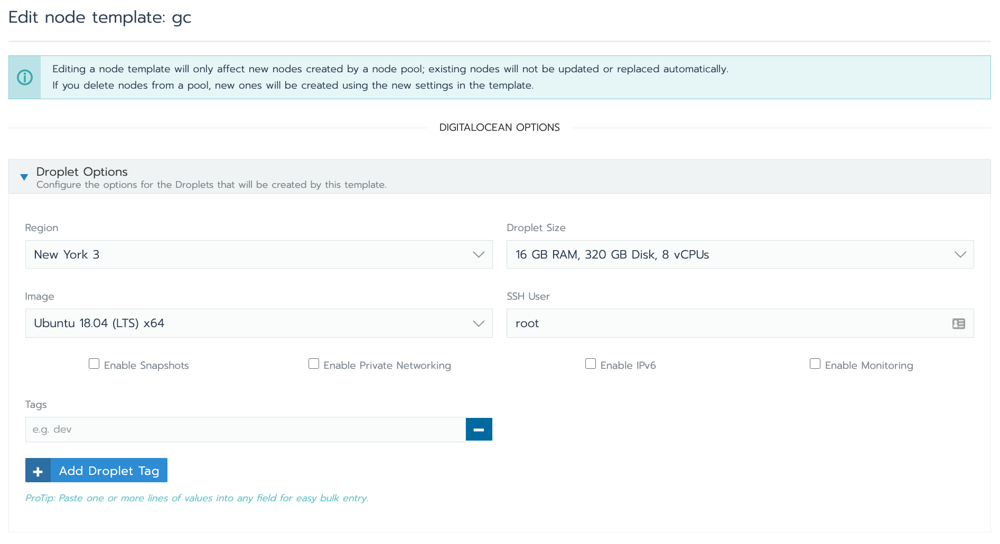

# Developer Mode Installation

:::note
Developer mode (dev mode) is intended to be used for local testing and development purposes.
:::

## Requirements

- The Kubernetes node must pass the [host-check](https://raw.githubusercontent.com/harvester/harvester/master/hack/host-check.sh)
- If the Kubelet's RootDir is not `/var/lib/kubelet`, you must create a `bind mount` to `/var/lib/kubelet` as follows:
   ```bash
   KUBELET_ROOT_DIR="path to your kubelet root dir"
   echo "${KUBELET_ROOT_DIR} /var/lib/kubelet none bind 0 0" >> /etc/fstab
   mkdir -p /var/lib/kubelet && mount -a
   ```
- [**Multus**](https://kubernetes.io/docs/concepts/cluster-administration/networking/#multus-a-multi-network-plugin) is installed across your cluster and a corresponding `NetworkAttachmentDefinition` CRD is created.
- The Harvester Chart already contains the Kubevirt and Longhorn

## Installation

For development purpose, Harvester can be installed on a Kubernetes cluster by using the [Helm](https://helm.sh/) CLI.

Please refer to the Harvester [Helm chart](https://github.com/harvester/harvester/blob/master/deploy/charts/harvester/README.md) for more details on installing and configuring the Helm chart.

1. Create the cattle-system namespace
   ```bash
   kubectl create ns cattle-system
   ```

1. Add the rancher-latest helm repo
   ```bash
   helm repo add rancher-latest https://releases.rancher.com/server-charts/latest
   ```

1. Install Rancher chart
   ```bash
   helm install rancher rancher-latest/rancher \
   --namespace cattle-system \
   --set tls=external \
   --set rancherImagePullPolicy=IfNotPresent \
   --set rancherImage=rancher/rancher \
   --set rancherImageTag=v2.6.3-harvester1 \
   --set noDefaultAdmin=false \
   --set features="multi-cluster-management=false\,multi-cluster-management-agent=false" \
   --set useBundledSystemChart=true \
   --set bootstrapPassword=admin
   ```

1. Change the 'status.provider' of the local cluster object to "harvester"
   ```bash
   kubectl edit clusters.management.cattle.io local
   ```

1. Clone the GitHub repository
   ```bash
   git clone https://github.com/harvester/harvester.git --depth=1
   ```

1. Go to the Helm chart
   ```bash
   cd harvester/deploy/charts
   ```

1. Create the harvester-system namespace
   ```bash
   kubectl create ns harvester-system
   ```

1. Install the Harvester crd chart
   ```bash
   helm install harvester-crd ./harvester-crd --namespace harvester-system
   ```

1. Install the Harvester chart
   ```bash
   ## In order to use the service type LoadBalancer and create a vip in control-plane nodes, we need to enable kubevip.
   VIP_IP="replace with your vip ip, such as 192.168.5.10"
   VIP_NIC="replace with your vip interface name, such as eth0"
   helm install harvester ./harvester --namespace harvester-system \
   --set harvester-node-disk-manager.enabled=true \
   --set harvester-network-controller.enabled=true \
   --set harvester-load-balancer.enabled=true \
   --set kube-vip.enabled=true \
   --set kube-vip.config.vip_interface=${VIP_NIC} \
   --set kube-vip.config.vip_address=${VIP_IP} \
   --set service.vip.enabled=true \
   --set service.vip.ip=${VIP_IP}
   ```

   ```bash
   ## In some Kubernetes distributions (such as kubeadm), we need to modify the kube-vip nodeSelector to match the control-plane nodes.
   --set kube-vip.nodeSelector."node-role\.kubernetes\.io/master"=""
   ```

1. Expose Harvester UI
   ```bash
   ## Refer to https://kube-vip.chipzoller.dev/docs/usage/cloud-provider/. Add `cidr-cattle-system: ${VIP_IP}/32` to kubevip configMap.
   kubectl -n kube-system edit cm kubevip

   ## Change the rancher service type from ClusterIP to LoadBalancer, and then you can access Harvester UI via https://${VIP_IP}.
   kubectl -n cattle-system edit svc rancher
   ```

### DigitalOcean Test Environment

You can create a test Kubernetes environment in Rancher using [DigitalOcean](https://www.digitalocean.com/) as a cloud provider, which supports nested virtualization.

We recommend using a `8 core, 16 GB RAM` droplet, which will have nested virtualization enabled by default.

This screenshot shows how to create a Rancher node template that would allow Rancher to provision such a node in DigitalOcean:



For more information on how to launch DigitalOcean nodes with Rancher, refer to the [Rancher documentation.](https://rancher.com/docs/rancher/v2.x/en/cluster-provisioning/rke-clusters/node-pools/digital-ocean/)
