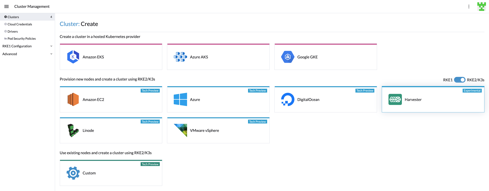

# Creating an RKE2 Kubernetes Cluster

Users can now provision RKE2 Kubernetes clusters on top of the Harvester cluster in Rancher `v2.6.1+` using the built-in Harvester node driver.



:::note
- Harvester RKE2 node driver is in tech preview.
- VLAN network is required for Harvester node driver.
:::

### Create Your Cloud Credentials

1. Click **☰ > Cluster Management**.
2. Click **Cloud Credentials**.
3. Click **Create**.
4. Click **Harvester**.
5. Enter your cloud credential name
6. Select "Imported Harvester" or "External Harvester".
7. Click **Create**.


###  Create RKE2 Kubernetes Cluster

Users can create a RKE2 Kubernetes cluster from the **Cluster Management** page via the RKE2 node driver.

1. Select **Clusters** menu.
2. Click **Create** button.
3. Toggle Switch to **RKE2/K3s**.
4. Select Harvester node driver.
5. Select a **Cloud Credential**.
6. Enter **Cluster Name** (required).
7. Enter **Namespace** (required).
8. Enter **Image** (required).
9. Enter **Network Name** (required).
10. Enter **SSH User** (required).
11. Click **Create**.


:::note
- RKE2 v1.21.5+rke2r2 or above provides a built-in Harvester Cloud Provider and Guest CSI driver integration.
- Currently only imported Harvester clusters are supported automatically.
:::


### Using Harvester RKE2 Node Driver in Air Gapped Environment

RKE2 provisioning relies on the `qemu-guest-agent` to get the IP of the virtual machine. However, it may not be feasible to install `qemu-guest-agent` in an air gapped environment.

You can address the installation constraints with the following options:

Option 1. Use a VM image with `qemu-guest-agent` installed.

Option 2. Configure the `cloud init` user data to enable the VMs to install `qemu-guest-agent` via an HTTP(S) proxy.

Example user data in Harvester node template:
```
#cloud-config
apt:
  http_proxy: http://192.168.0.1:3128
  https_proxy: http://192.168.0.1:3128
```
