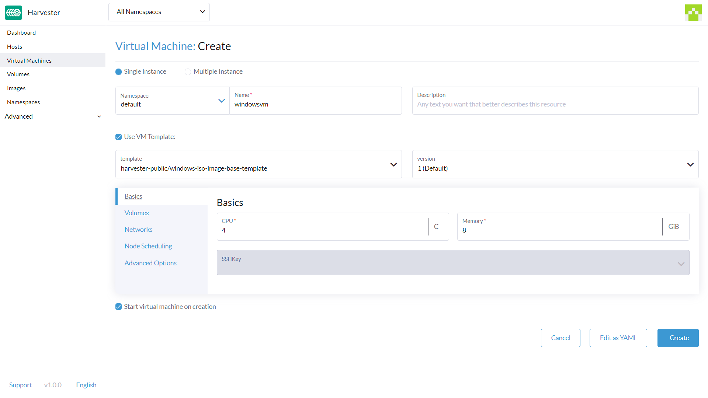
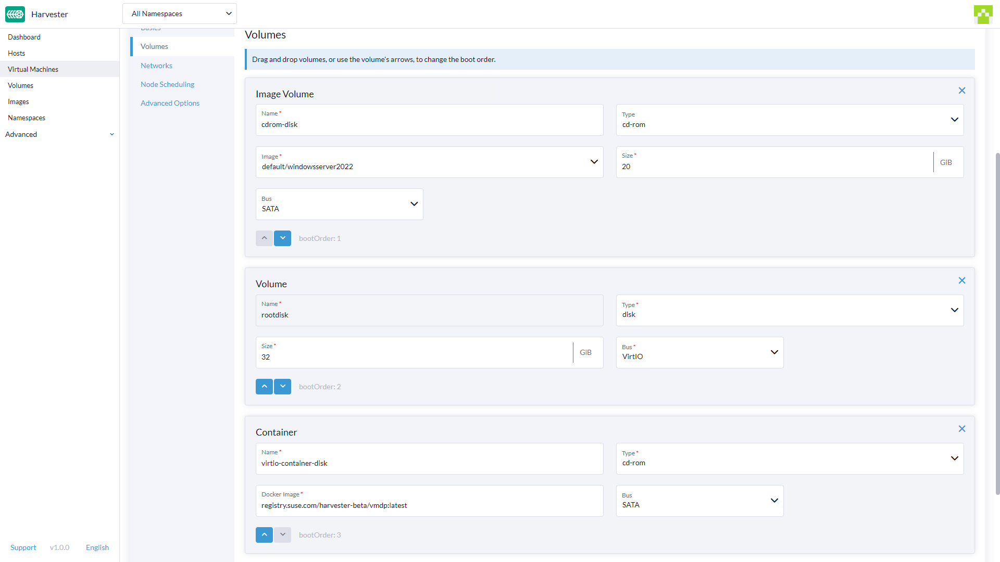
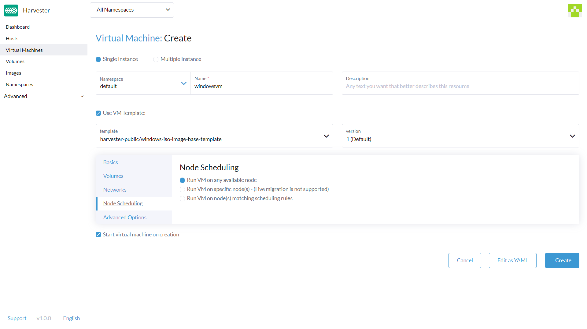
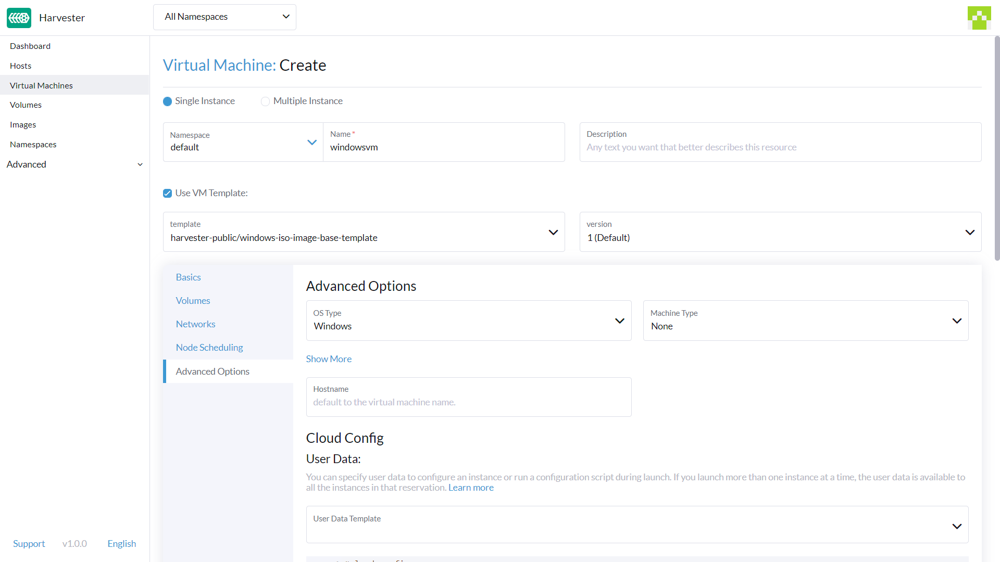
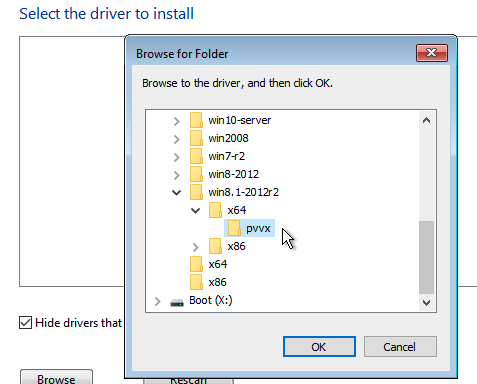
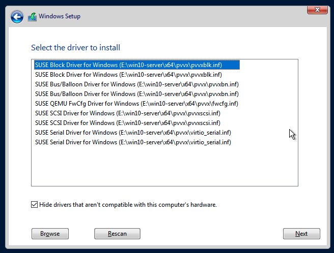
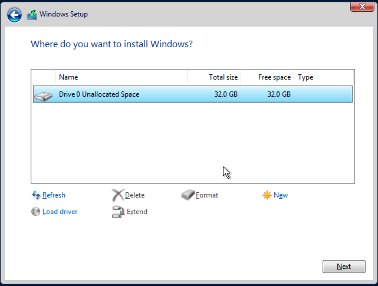

# Create a Windows Virtual Machine

Create one or more virtual machines from the **Virtual Machines** page.

:::note
For creating Linux virtual machines, please refer to [this page](./create-vm.md).
:::

## Header Section

1. Create a single VM instance or multiple VM instances.
1. Set the VM name.
1. [Optional] Provide a description for the VM.
1. [Optional] Select the VM template `windows-iso-image-base-template`. This template will add a volume with the `virtio` drivers for Windows.

## Basics Tab

1. Configure the number of `CPU` cores assigned to the VM.
1. Configure the amount of `Memory` assigned to the VM.
1. [Optional] Select existing `SSH keys` or upload new ones.

:::note
As mentioned above, it is recommended that you use the Windows VM template. The `Volumes` section will describe the options which the Windows VM template created automatically.
:::

:::caution
The `bootOrder` values need to be set with the installation image first. If you change it, your VM might not boot into the installation disk.
:::

## Volumes Tab

1. The **first volume** is an `Image Volume` with the following values: 
    1. `Name`: The value `cdrom-disk` is set by default. You can keep it or change it.
    2. `Image`: Select the Windows image to be installed. See [Upload Images](../upload-image/) for the full description on how to create new images.
    3. `Type`: Select `cd-rom`.
    4. `Size`: The value `20` is set by default. You can change it if your image has a bigger size.
    5. `Bus`: The value `SATA` is set by default. It's recommended you don't change it.
2. The **second volume** is a `Volume` with the following values:
    1.  `Name`: The value `rootdisk` is set by default. You can keep it or change it.
    2.  `Size`: The value `32` is set by default. See the disk space requirements for [Windows Server](https://docs.microsoft.com/en-us/windows-server/get-started/hardware-requirements#storage-controller-and-disk-space-requirements) and [Windows 11](https://docs.microsoft.com/en-us/windows/whats-new/windows-11-requirements#hardware-requirements) before changing this value.
    3.  `Bus`: The value `VirtIO` is set by default. You can keep it or change it to the other available options, `SATA` or `SCSI`.
3. The **third volume** is a `Container` with the following values:
    1. `Name`: The value `virtio-container-disk` is set by default. You can keep it or change it.
    2. `Docker Image`: The value `registry.suse.com/suse/vmdp/vmdp:2.5.3` is set by default. It's recommended you don't change it.
    3. `Bus`: The value `SATA` is set by default. It's recommended you don't change it.
4. You can add additional disks using the buttons `Add Volume`, `Add Existing Volume`, `Add VM Image`, or `Add Container`.

## Networks Tab

1. The **Management Network** is added by default with the following values: 
    1. `Name`:  The value `default` is set by default. You can keep it or change it.
    2. `Network`: The value `management Network` is set by default. You can't change this option if no other network has been created. See [Harvester Network](../networking/harvester-network) for the full description on how to create new networks.
    3. `Model`: The value `e1000` is set by default. You can keep it or change it to the other available options from the dropdown.
    4. `Type`: The value `masquerade` is set by default. You can keep it or change it to the other available option, `bridge`.
2. You can add additional networks by clicking  `Add Network`.

:::caution
Changing the `Node Scheduling` settings can impact Harvester features, such as disabling `Live migration`.
:::

## Node Scheduling Tab

1. `Node Scheduling` is set to `Run VM on any available node` by default. You can keep it or change it to the other available options from the dropdown.

## Advanced Options Tab

1. `OS Type`: The value `Windows` is set by default. It's recommended you don't change it.
2. `Machine Type`: The value `None` is set by default. It's recommended you don't change it. See the [KubeVirt Machine Type](https://kubevirt.io/user-guide/virtual_machines/virtual_hardware/#machine-type) documentation before you change this value.
3. [Optional] `Hostname`: Set the VM hostname.
4. [Optional] `Cloud Config`: Both `User Data` and `Network Data` values are set with default values. Currently, these configurations are not applied to Windows-based VMs.

## Footer Section

1. `Start virtual machine on creation`: This option is checked by default. You can uncheck it if you don't want the VM to start once it's created.

Once all the settings are in place, click on `Create` to create the VM.

:::note
If you need to add advanced settings, you can edit the VM configuration directly by clicking on `Edit as YAML`.
And if you want to cancel all changes made, click `Cancel`.
:::

## Installation of Windows

1. Select the VM you just created, and click `Start` to boot up the VM.(If you checked `Start virtual machine on creation` the VM will start automatically once it's created)
2. Boot into the installer, and follow the instruction given by the installer.
3. [Optional] If you are using `virtio` based volumes, you will need to load the specific driver to allow installer detect them. If you're using VM template `windows-iso-image-base-template`, the instruction are as follows:
    1. Click on `Load driver` and click `Browse` on the dialog box, and find a CD-ROM drive with `VMDP-WIN` prefix. Find the driver directory according to the Windows version you're installing, for example: Windows Server 2012r2 should expand `win8.1-2012r2` and choose the `pvvx` directory inside.
    
    2. Click `OK` to allow installer to scan this directory for drivers, choose `SUSE Block Driver for Windows` and clock `Next` to load the driver.
    
    1. Wait for the installer to load up the driver. If you're choosing correct version of driver the `virtio` volumes should be detected once the driver is loaded.
    
    1. Operate this drive at your own discretion.
4. [Optional] If you are using `virtio` based hardware, like virtio network adapter, you will need to manually install those drivers after you complete the installation. To install drivers, open the virtio driver disk, and open the installer based on your platform.

:::note
If you need to use other VM template rather than the `windows-iso-image-base-template` we provided, and you still need `virtio` devices, please be sure to provide your own virtio driver disk in order to detect hardware correctly.
:::