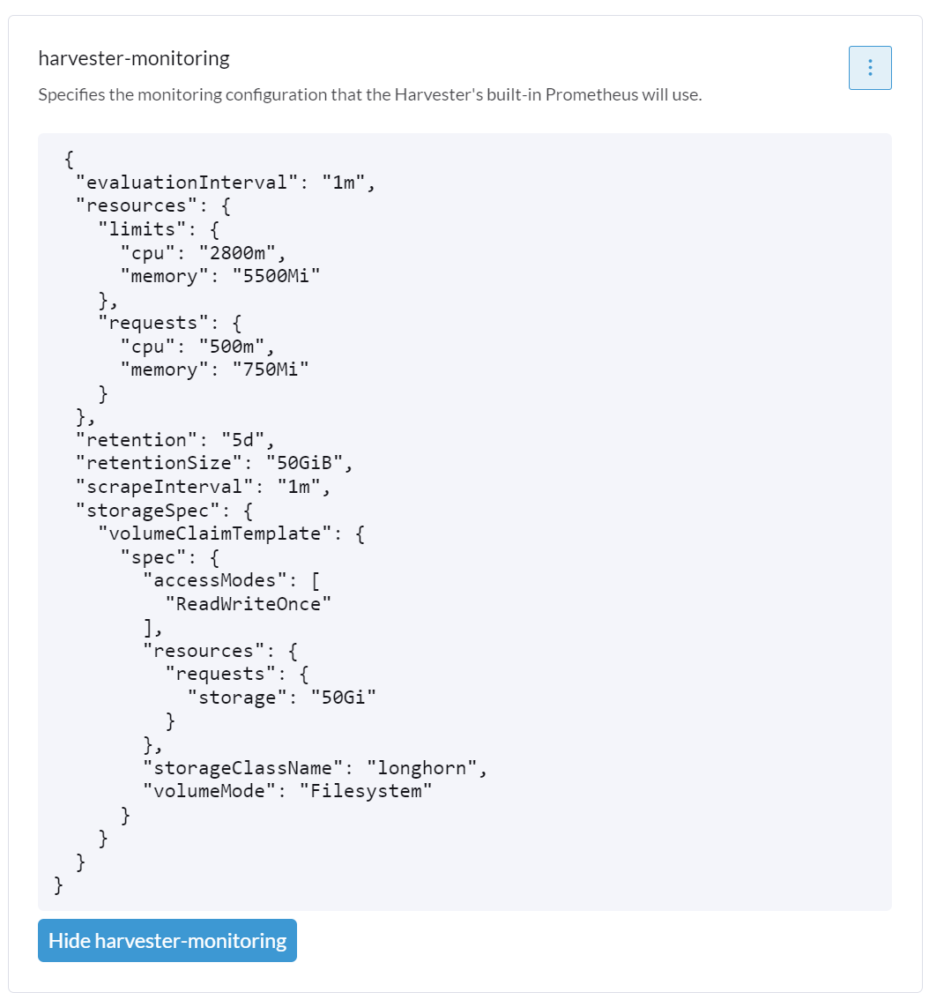
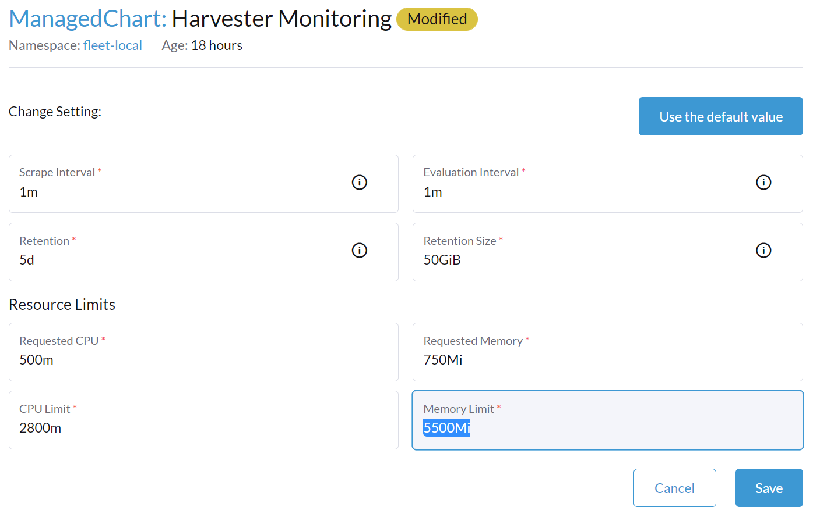

# 监控

_从 v0.3.0 起可用_

## 仪表盘指标
Harvester `v0.3.0` 已使用 [Prometheus](https://prometheus.io/) 内置集成监控。监控会在 ISO 安装期间自动安装。

在 Harvester 的 `Dashboard` 页面中，你可以分别查看集群指标以及最常用的 10 个虚拟机指标。
此外，你可以单击 [Grafana](http://grafana.com/) 仪表盘链接，从而在 Grafana UI 上查看更多仪表盘。


:::note
只有管​​理员用户才能查看仪表盘指标。
:::


## 虚拟机详细指标
你可以单击虚拟机的详情页面来查看每个虚拟机的指标。


:::note
`Memory Usage` 的计算公式是 `(1 - 剩余/总量) x 100%`，而不是 `(已使用/总量) x 100%`。
:::

例如，在 Linux 操作系统中，`free -h` 命令输出当前内存的统计信息：

```
$ free -h
              total        used        free      shared  buff/cache   available
Mem:          7.7Gi       166Mi       4.6Gi       1.0Mi       2.9Gi       7.2Gi
Swap:            0B          0B          0B
```

对应的 `Memory Usage` 为 `(1 - 4.6/7.7) x 100%`，即大致为 `40%`。


## 更改 Monitoring 的资源设置
_从 v1.0.1 起可用_

`Monitoring` 有几个组件，这些组件可以收集所有 NODE/POD/VM/等指标数据并对其进行汇总。`Monitoring` 所需的资源与工作负载和硬件资源有关。Harvester 会根据工程实践设置默认值，你可以相应地更改它们。

以下是两个可用的组件`资源设置`：

(1) Monitoring-Prometheus

(2) Monitoring-Prometheus-node-exporter

### 更改 Monitoring-Prometheus 的资源设置

#### 使用 WebUI

在 `Advanced Settings` 页面中，你可以查看和更改资源设置：

(1) 导航到 **Settings** 页面，找到 `harvester-monitoring`：


(2) 点击 `Show harvester-monitoring` 以查看当前的值：


(3) 点击右上角的弹出菜单，选择 `Edit Setting` 以设置新值：


(4) 点击 `Save`。`Monitoring` 将使用新的资源设置重新启动。请注意，重新启动可能需要一些时间。

最常用的选项是内存设置。

`Requested Memory` 是 `Monitoring` 的最小内存。建议设置为单个管理节点系统内存的 5% 到 10%。小于 500Mi 的值将被拒绝。

`Memory Limit`是 `Monitoring` 的最大内存。建议设置为单个管理节点系统内存的 30% 左右，`Monitoring` 达到这个值时会重新启动。

你可以根据可用的硬件资源和系统负载相应地更改设置。

:::note
如果你有多个不同硬件资源的管理节点，请根据较小的节点来设置。
:::

#### 使用 CLI

你可以使用 CLI 命令 `kubectl edit managedchart rancher-monitoring -nfleet-local` 来更新这些值。

在 v1.0.1 及以后的版本中，相关路径和默认值为：

`spec.values.prometheus.prometheusSpec.resources.limits.cpu`:`1000m`

`spec.values.prometheus.prometheusSpec.resources.limits.memory`:`2500Mi`

`spec.values.prometheus.prometheusSpec.resources.requests.cpu`:`750m`

`spec.values.prometheus.prometheusSpec.resources.requests.memory`:`1750Mi`

在 v1.0.0 及之前的版本中，相关路径和默认值不在 `managedchart rancher-monitoring` 中，你需要相应添加它们。

### 更改 Monitoring-Prometheus-node-exporter 的资源设置

`Monitoring-Prometheus-node-exporter` 的资源规范与 `Monitoring-Prometheus` 的类似。

#### 使用 WebUI

_从 v1.0.2 起可用_

参阅上方`更改 Monitoring-Prometheus 的资源设置`下`使用 WebUI` 中描述的步骤，选择 `Edit Setting` 后，页面将显示为：


#### 使用 CLI

你可以使用 CLI 命令 `kubectl edit managedchart rancher-monitoring -nfleet-local` 来更新这些值。

在 v1.0.1 及以后的版本中，相关路径和默认值为：

`spec.values.prometheus-node-exporter.resources.limits.cpu`:`200m`

`spec.values.prometheus-node-exporter.resources.limits.memory`:`180Mi`

`spec.values.prometheus-node-exporter.resources.requests.cpu`:`100m`

`spec.values.prometheus-node-exporter.resources.requests.memory`:`30Mi`

在 v1.0.0 及之前的版本中，相关路径和默认值不在 `managedchart rancher-monitoring` 中，你需要相应添加它们。

:::note
如果多个 VM 部署在一个 NODE 中，你可能会看到 /prometheus-node-exporter POD 的 OOM（out of memory）异常重启。在这种情况下，你需要将 `limits.memory` 设置为更大的值。
:::

### 故障排除

如果你在使用 Monitoring 时遇到问题，请参阅[故障排除](../troubleshooting/monitoring.md)。

