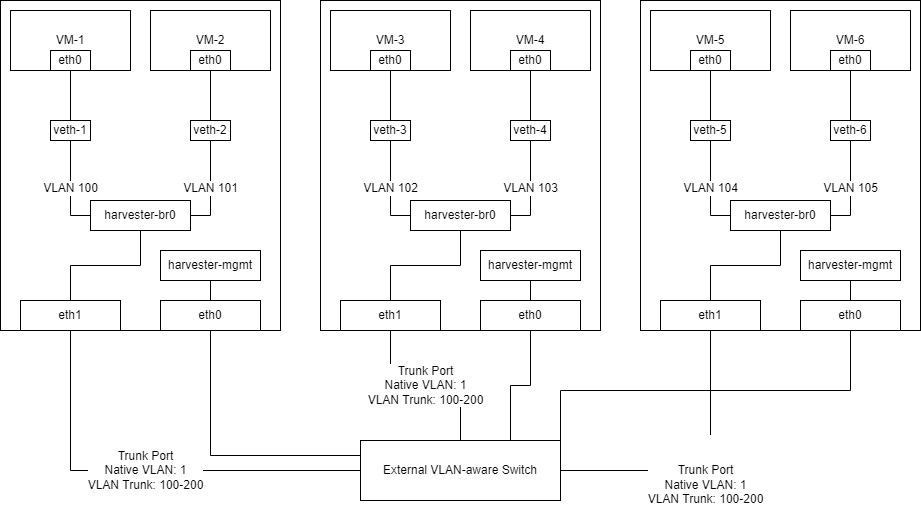

# 具有 VLAN 感知交换机的多个 NIC

在此“VLAN 感知”交换机配置的最佳实践指南中，我们将介绍常见场景下的 Harvester VLAN 网络和外部交换机配置。

## 架构

硬件：

- 三台带双端口网卡的 Harvester Server。
- 一个或多个 VLAN 感知交换机。我们将使用类似 Cisco 的配置作为示例。

网络规格：

- 假设 Harvester 主机的子网在 VLAN 100 中。
- 假设 VM 在 VLAN 101-200 中。

布线：

- Harvester Server 从端口 `1` 到端口 `6` 连接到交换机。

下图说明了本指南所用的布线：



## 外部交换机配置

对于外部交换机的网络，我们将使用类似 Cisco 的配置作为示例。你可以将以下配置应用于你的交换机：


对于 `harvester-mgmt` 端口：
```
switch# config terminal
switch(config)# interface ethernet1/<Port Number>
switch(config-if)# switchport
switch(config-if)# switchport mode access
switch(config-if)# switchport access 100
switch(config-if)# no shutdown
switch(config-if)# end
switch# copy running-config startup-config
```

:::note
在这种情况下，你需要避免使用 `harvester-mgmt` 作为 VLAN 网络接口。此设置只允许 `harvester-mgmt` 同一子网中的流量，不允许其他 VLAN 流量。
:::

对于 VLAN 网络端口：
```
switch# config terminal
switch(config)# interface ethernet1/<Port Number>
switch(config-if)# switchport
switch(config-if)# switchport mode trunk
switch(config-if)# switchport trunk allowed vlan 100-200
switch(config-if)# switchport trunk native vlan 1
switch(config-if)# no shutdown
switch(config-if)# end
switch# copy running-config startup-config
```

:::note
我们使用 VLAN 中继设置来设置 VLAN 网络的网络端口。在这种情况下，你可以简单地为 Harvester VLAN 网络中的 VM 设置 VLAN 100，从而连接到 `harvester-mgmt` 的同一子网。
:::

## 在 Harvester 中创建 VLAN 网络

你可以前往 **Advanced > Networks** 页面，然后点击 **Create** 按钮，来创建一个新的 VLAN 网络。

指定你要为 VLAN 网络设置的名称和 VLAN ID<small>（如果你配置了 [Rancher 多租户](../../rancher/virtualization-management.md#多租户)，你可以在不同的命名空间中指定相同的 VLAN ID）</small>：


### 将 VM 连接到 Harvester 主机的子网

完成上一节中的配置后，外部交换机会将未标记的网络流量发送到 Harvester 主机的子网。在 Harvester 中，未标记的流量在 VLAN 1 中接收。

因此，如果需要 VM 连接到 VLAN ID 1，则也需要在 Harvester 中创建 VLAN ID 1 网络。

:::note
强烈建议不要在这种情况下使用 VLAN 1。
:::

### 将 VM 连接到特定 VLAN 网络

你需要创建一个具有特定 VLAN ID 的 VLAN 网络，并将 VM 关联到该 VLAN 网络。

有关 Harvester 网络的更多信息，请参阅[此页面](../harvester-network.md)。
