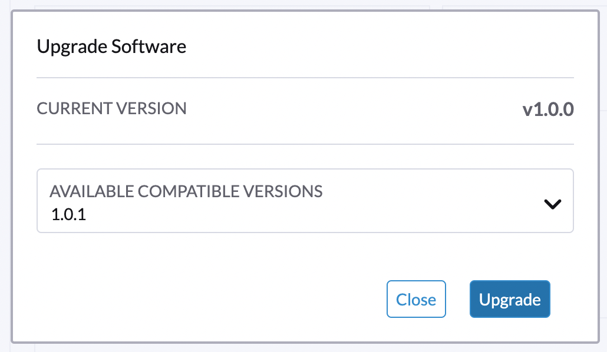
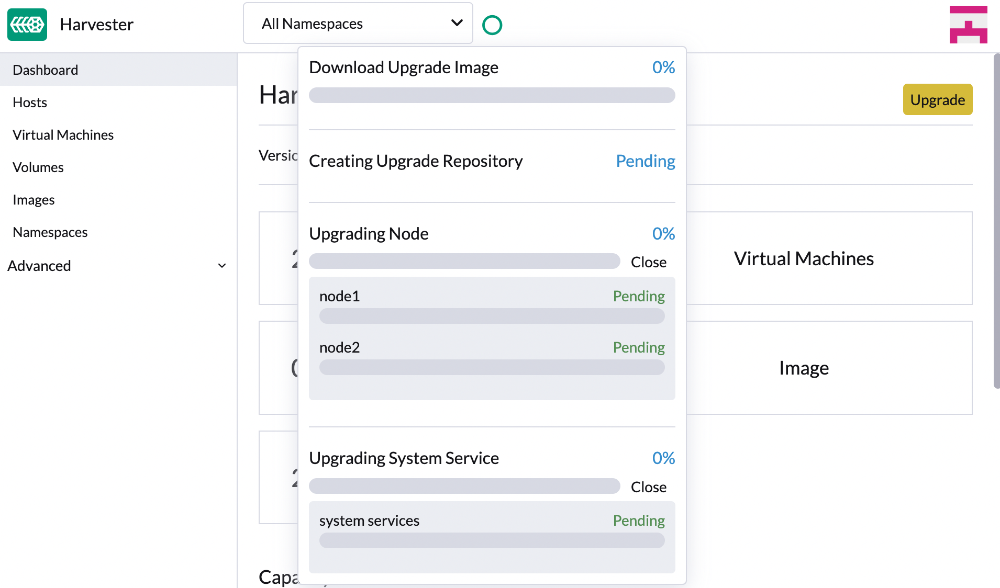

# 升级 Harvester

## Upgrade support matrix

The following table shows the upgrade path of all supported versions.

| Upgrade from version | Supported new version(s) |
|----------------------|--------------------------|
| [v1.0.1](./v1-0-1-to-v1-0-2.md) | v1.0.2 |
| [v1.0.0](./v1-0-0-to-v1-0-1.md) | v1.0.1 |

## Start an upgrade

Note we are still working towards zero-downtime upgrade, due to some known issues please follow the steps below before you upgrade your Harvester cluster:

:::caution
- Before you upgrade your Harvester cluster, we highly recommend:
   - Shutting down all your VMs (Harvester GUI -> Virtual Machines -> Select VMs -> Actions -> Stop).
   - Back up your VMs.
- Do not operate the cluster during an upgrade. For example, creating new VMs, uploading new images, etc.
- Make sure your hardware meets the **preferred** [hardware requirements](../intro.md#硬件要求). This is due to there will be intermediate resources consumed by an upgrade.
- Make sure each node has at least 25 GB of free space (`df -h /usr/local/`).
:::

:::caution
- Make sure all nodes' times are in sync. 建议使用 NTP 服务器来同步时间。如果你在安装期间没有配置 NTP 服务器，你可以**在每个节点上**手动添加一个 NTP 服务器：

   ```
   $ sudo -i

   # Add time servers
   $ vim /etc/systemd/timesyncd.conf
   [ntp]
   NTP=0.pool.ntp.org

   # Enable and start the systemd-timesyncd
   $ timedatectl set-ntp true

   # Check status
   $ sudo timedatectl status
   ```
:::

:::caution
- NICs that connect to a PCI bridge might be renamed after an upgrade. Please check the [knowledge base article](https://harvesterhci.io/kb/nic-naming-scheme) for further information.
:::


- Make sure to read the Warning paragraph at the top of this document first.
- Harvester checks if there are new upgradable versions periodically. If there are new versions, an upgrade button shows up on the Dashboard page.
   - If the cluster is in an air-gapped environment, please see [Prepare an air-gapped upgrade](#prepare-an-air-gapped-upgrade) section first. You can also speed up the ISO download by using the approach in that section.
- Navigate to Harvester GUI and click the upgrade button on the Dashboard page.

   

- Select a version to start upgrading.

   

- Click the circle on the top to display the upgrade progress.
   


## Prepare an air-gapped upgrade

:::caution
Make sure to check [Upgrade support matrix](#upgrade-support-matrix) section first about upgradable versions.
:::

- Download a Harvester ISO file from [release pages](https://github.com/harvester/harvester/releases).
- Save the ISO to a local HTTP server. Assume the file is hosted at `http://10.10.0.1/harvester.iso`.
- Download the version file from release pages, for example, `https://releases.rancher.com/harvester/{version}/version.yaml`

   - Replace `isoURL` value in the `version.yaml` file:

      ```
      apiVersion: harvesterhci.io/v1beta1
      kind: Version
      metadata:
        name: v1.0.2
        namespace: harvester-system
      spec:
        isoChecksum: <SHA-512 checksum of the ISO>
        isoURL: http://10.10.0.1/harvester.iso  # change to local ISO URL
        releaseDate: '20220512'
      ```

   - Assume the file is hosted at `http://10.10.0.1/version.yaml`.

- Log in to one of your control plane nodes.
- Become root and create a version:

   ```
   rancher@node1:~> sudo -i
   rancher@node1:~> kubectl create -f http://10.10.0.1/version.yaml
   ```

- An upgrade button should show up on the Harvester GUI Dashboard page.
