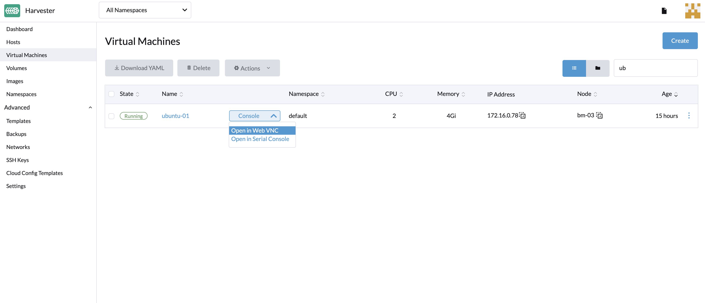
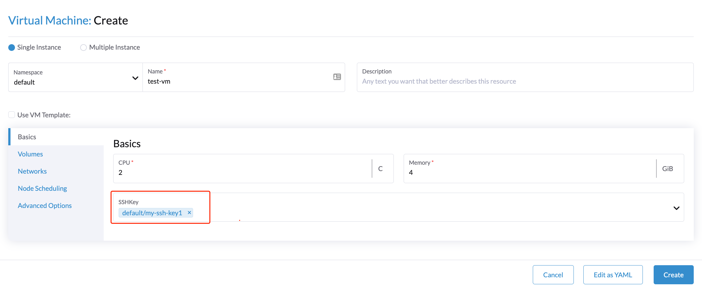
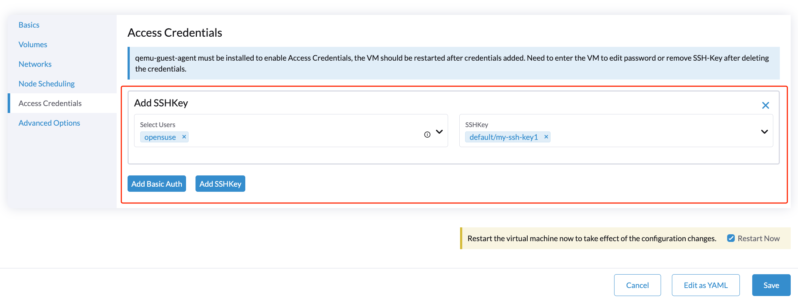

# 访问虚拟机

虚拟机运行后，你可以在 Harvester UI 通过 `VNC` 客户端或串行控制台访问虚拟机。

在使用 VLAN 网络的情况下，你也可以直接从本地电脑远程 SSH 到客户端进行连接。

## 使用 Harvester UI 访问

你可以使用 VNC 或串行控制台直接从 UI 访问虚拟机。

如果虚拟机上未启用 VGA 显示，例如 `Ubuntu minimal-cloud` 镜像，则仅可以使用串行控制台访问虚拟机。



## SSH 访问

Harvester 提供了两种将 SSH 公钥注入虚拟机的方法。通常，这些方法分为两类。第一类是[静态密钥注入](#通过-cloud-init-进行静态-ssh-密钥注入)，即在虚拟机首次开机时将密钥放在 cloud-init 脚本中。第二类是[动态注入](#通过-qemu-guest-agent-进行动态-ssh-密钥注入)，即允许在运行时动态更新密钥或基本认证。

### 通过 cloud-init 进行静态 SSH 密钥注入

你可以在创建期间在 `Basics` 选项卡上为虚拟机提供 SSH 密钥。此外，你可以将公共 SSH 密钥放在 cloud-init 脚本中。



#### SSH 密钥 cloud-init 配置示例：
```yaml
#cloud-config
ssh_authorized_keys:
  - >-
    ssh-rsa # 替换为你的公钥
```


### 通过 QEMU Guest Agent 进行动态 SSH 密钥注入

_从 v1.0.1 起可用_

Harvester 支持在运行时通过使用 [QEMU GuestAgent](https://wiki.qemu.org/Features/GuestAgent) 动态注入公共 SSH 密钥。这是通过 `qemuGuestAgent` 传播方法实现的。

:::note
此方法要求在 Guest VM 中安装 QEMU GuestAgent。

使用 `qemuGuestAgent` 传播时，`/home/$USER/.ssh/authorized_keys` 文件将归 GuestAgent 所有。在 QEMU GuestAgent 之外对该文件所做的更改将被删除。
:::

你可以通过 Harvester 仪表板注入你的访问凭证，如下所示：

1. 选择虚拟机并单击 `⋮` 按钮。
2. 单击 `Edit Config` 按钮并转到 `Access Credentials` 选项卡。
3. 单击以添加基本认证凭证或 SSH 密钥（例如，添加 `opensuse` 作为用户，如果你的 Guest 操作系统是 OpenSUSE，则选择你的 SSH 密钥）。
4. 确保 QEMU GuestAgent 已安装，并且在添加凭证后重启 VM。

:::note
从 UI 中删除凭证后，你需要进入 VM 以便编辑密码或删除 SSH-Key。
:::




### 使用 SSH 客户端访问
虚拟机运行后，你可以在终端仿真客户端（例如 PuTTY）中输入虚拟机的 IP 地址。你还可以运行以下命令直接从计算机的 SSH 客户端访问虚拟机：

```
 ssh -i ~/.ssh/your-ssh-key user@<ip-address-or-hostname>
```
