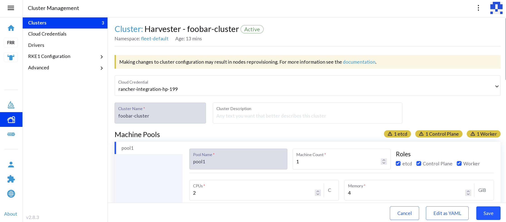

## Expiration of kubeconfig Tokens in Rancher 2.8.x

In Rancher 2.8.x, the default value of the [kubeconfig-default-token-ttl-minutes](https://ranchermanager.docs.rancher.com/api/api-tokens#kubeconfig-default-token-ttl-minutes) setting is `30` days.

A side effect of using this default value is the expiration of authentication tokens embedded in kubeconfigs that Rancher uses to provision guest Kubernetes clusters on Harvester. When such tokens expire, Rancher loses the ability to perform management operations for the corresponding Rancher-managed guest Kubernetes clusters. [Issue #44912](https://github.com/rancher/rancher/issues/44912) tracks the issue described in this article.

:::note
The issue affects only guest Kubernetes clusters running on Harvester that use cloud credentials created after installing or upgrading to Rancher v2.8.x.
:::

## Workaround

You can patch the expired Harvester cloud credentials to use a new authentication token.

1. Identify the expired cloud credentials for the cluster.

  

1. Generate a new Rancher authentication token with the value of **Scope** set to **No Scope**. You can customize the TTL for the token (for example, a value of `0` results in tokens that do not expire).

  

1. Generate a kubeconfig to access the Rancher server using the [instructions](https://ranchermanager.docs.rancher.com/api/quickstart) in the Rancher documentation.

1. The cloud credential is stored as a secret in `cattle-global-data` namespace, and can be patched with new authentication token. Ensure that the environment variable `KUBECONFIG` points to the generated kubeconfig.

  ```shell
  #!/bin/sh
  CLOUD_CREDENTIAL_NAME=$1
  API_TOKEN=$2

  kubeconfig=$(kubectl get secret $CLOUD_CREDENTIAL_NAME -n cattle-global-data -o yaml |   yq '.data.harvestercredentialConfig-kubeconfigContent' | base64 -d | token=${API_TOKEN} yq -e '.users[0].user.token = env(token)' | base64 -w 0)

  patch_file=$(mktemp)

  cat > ${patch_file} <<EOF
  data:
    harvestercredentialConfig-kubeconfigContent: $kubeconfig
  EOF

  kubectl patch secret ${CLOUD_CREDENTIAL_NAME} -n cattle-global-data --patch-file ${patch_file} --type merge
  rm ${patch_file}
  ```

  :::info important
  macOS users must use `gbase64` to ensure that the `-w` flag is supported.
  :::